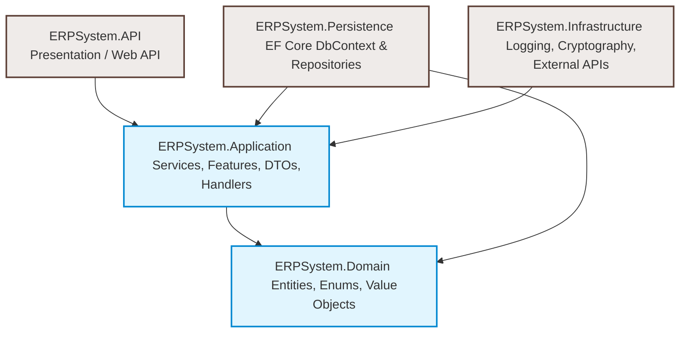
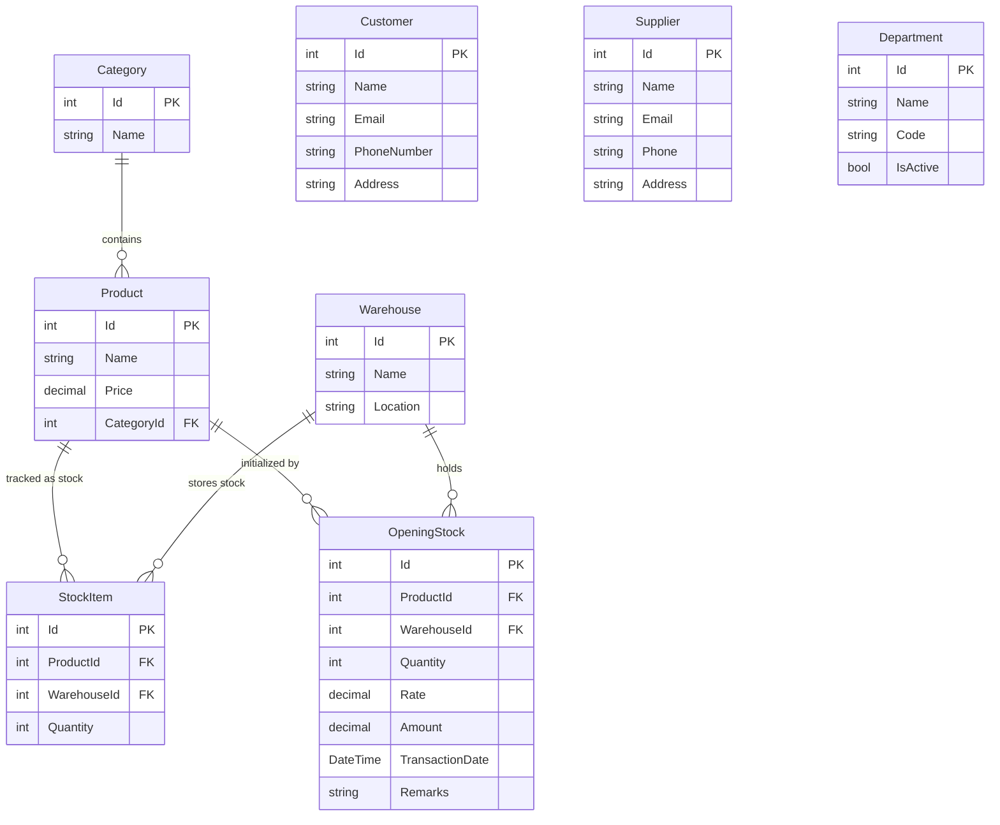
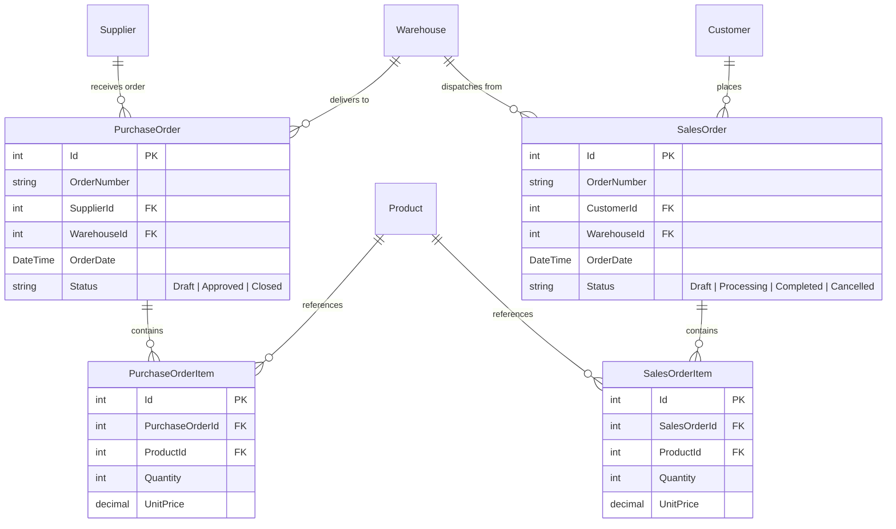
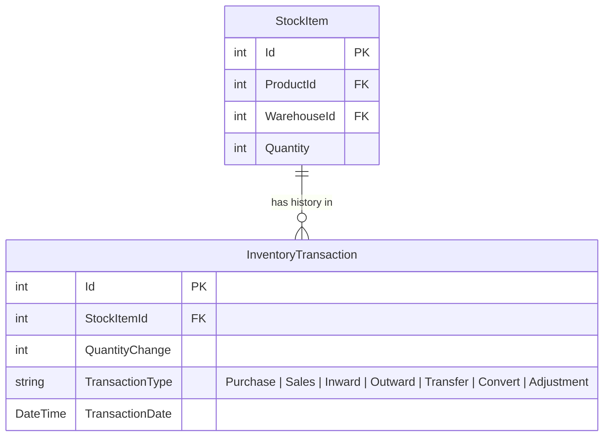
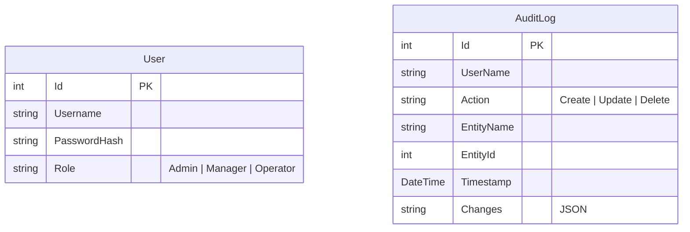

# Enterprise Resource Planning (ERP) System

[](https://dotnet.microsoft.com/)
[](https://react.dev/)
[](https://mui.com/)
[](https://learn.microsoft.com/en-us/ef/core/)
[](https://www.microsoft.com/en-us/sql-server)
[](LICENSE)

A robust, enterprise-grade ERP system built using **Clean Architecture** principles on the backend (ASP.NET Core Web API with EF Core & SQL Server) and a modern **React SPA Dashboard** on the frontend (powered by Vite, TypeScript, and the Mantis Material-UI template).

---

## 🏗️ Architecture Overview

The system is designed following the **Clean Architecture** (Onion Architecture) pattern, which enforces strict separation of concerns, decoupling business logic from external frameworks, databases, and UI components.



### Backend Project Breakdown
- **[ERPSystem.Domain](file:///c:/Users/VRAJ/source/repos/ERPSystem/ERPSystem.Domain)**: The core of the system. Contains all enterprise database entities, enums, value objects, and business rules. Has zero external dependencies.
- **[ERPSystem.Application](file:///c:/Users/VRAJ/source/repos/ERPSystem/ERPSystem.Application)**: Orchestrates the business logic. Contains system-wide services, data transfer objects (DTOs), mapping configurations, validation logic (via FluentValidation), and repository interfaces.
- **[ERPSystem.Persistence](file:///c:/Users/VRAJ/source/repos/ERPSystem/ERPSystem.Persistence)**: Contains database infrastructure details, entity mappings, migrations, and repository implementations powered by **Entity Framework Core**.
- **[ERPSystem.Infrastructure](file:///c:/Users/VRAJ/source/repos/ERPSystem/ERPSystem.Infrastructure)**: Implements infrastructure-specific services such as token generation, security, file storage, or external email notifications.
- **[ERPSystem.API](file:///c:/Users/VRAJ/source/repos/ERPSystem/ERPSystem.API)**: The entry point of the backend application. Houses REST controllers, authentication middleware, error handling filters, and Swagger configurations.

### Frontend Integration
- **[erp-frontend](file:///c:/Users/VRAJ/source/repos/ERPSystem/erp-frontend)**: A decoupled React dashboard application built using **Vite**, **TypeScript**, and **Material-UI** (Mantis Theme). It communicates asynchronously with the API. In a production build, the compiled static assets are hosted directly from the API's `wwwroot` directory.

---

## 🗄️ Database Entity-Relationship (ER) Diagrams

To keep diagrams readable and comprehensive, the database model is categorized into logical modules. These diagrams are written in **Mermaid.js** syntax and render natively.

### 1. Catalog & People (Master Data)
Tracks the basic master records that populate the rest of the business documents.



### 2. Purchasing & Sales Modules
Manages trade transactions with Suppliers (Purchasing) and Customers (Sales).



### 3. Core Inventory & Ledger
Monages stock allocations and provides an audit ledger of all physical inventory changes.



### 4. Inventory Documents & Vouchers
Covers all inventory movements and voucher documents that record details, approvals, and logs of stock entering, leaving, or shifting between departments and warehouses.

```mermaid
erDiagram
    Department ||--o{ Indent : "requests (FromDept)"
    Department ||--o{ Indent : "targets (ToDept)"
    Indent ||--o{ IndentLine : "contains"
    Product ||--o{ IndentLine : "requests"

    PurchaseOrder ||--o{ GoodsReceiptNote : "fulfills"
    GoodsReceiptNote ||--o{ GoodsReceiptNoteLine : "contains"
    Product ||--o{ GoodsReceiptNoteLine : "receives"

    Warehouse ||--o{ TransferSlip : "ships from (FromWarehouse)"
    Warehouse ||--o{ TransferSlip : "delivers to (ToWarehouse)"
    TransferSlip ||--o{ TransferSlipLine : "contains"
    Product ||--o{ TransferSlipLine : "references"

    Customer ||--o{ DeliveryChallan : "dispatched to"
    Warehouse ||--o{ DeliveryChallan : "dispatched from"
    DeliveryChallan ||--o{ DeliveryChallanLine : "contains"
    Product ||--o{ DeliveryChallanLine : "references"

    StockConvert ||--o{ StockConvertSourceLine : "consumes"
    StockConvert ||--o{ StockConvertDestinationLine : "produces"
    Product ||--o{ StockConvertSourceLine : "references"
    Product ||--o{ StockConvertDestinationLine : "references"
    Warehouse ||--o{ StockConvertSourceLine : "deducts from"
    Warehouse ||--o{ StockConvertDestinationLine : "stores to"

    Warehouse ||--o{ MaterialInward : "enters into"
    MaterialInward ||--o{ MaterialInwardLine : "contains"
    Product ||--o{ MaterialInwardLine : "references"

    Warehouse ||--o{ MaterialOutward : "exits from"
    MaterialOutward ||--o{ MaterialOutwardLine : "contains"
    Product ||--o{ MaterialOutwardLine : "references"

    Indent {
        int Id PK
        string VoucherNo
        int RequestingDeptId FK
        int TargetDeptId FK
        DateTime IndentDate
        string Priority "High | Medium | Low"
        string Status "Pending | Approved | Disapproved"
        string Remarks
    }

    IndentLine {
        int Id PK
        int IndentId FK
        int LineNo
        int ProductId FK
        decimal Quantity
        decimal EstimatedRate
        decimal ShortClosedQuantity
        string Notes
    }

    GoodsReceiptNote {
        int Id PK
        string GrnNumber
        int PurchaseOrderId FK
        DateTime ReceivedDate
        string Status "PendingStoreApproval | Approved | Rejected"
        string Remarks
    }

    GoodsReceiptNoteLine {
        int Id PK
        int GoodsReceiptNoteId FK
        int ProductId FK
        int OrderedQuantity
        int ReceivedQuantity
    }

    TransferSlip {
        int Id PK
        string SlipNumber
        int FromWarehouseId FK
        int ToWarehouseId FK
        DateTime TransferDate
        string Status "Draft | Shipped | Approved | Cancelled"
        string Remarks
    }

    TransferSlipLine {
        int Id PK
        int TransferSlipId FK
        int LineNo
        int ProductId FK
        int Quantity
        int ShortClosedQuantity
        string Notes
    }

    DeliveryChallan {
        int Id PK
        string ChallanNumber
        int CustomerId FK
        int FromWarehouseId FK
        DateTime ChallanDate
        string Status "Draft | Shipped | Cancelled"
        string DispatchDocNo
        string DispatchThrough
        string Destination
        string TermsOfDelivery
        string LRNo
        DateTime LRDt
        string TransporterName
        bool IsLRReceived
        string ContactPerson
        string Remarks
    }

    DeliveryChallanLine {
        int Id PK
        int DeliveryChallanId FK
        int LineNo
        int ProductId FK
        int Quantity
        decimal UnitPrice
        decimal DiscountPercentage
        decimal DiscountAmount
        decimal TotalAmount
        string Notes
    }

    StockConvert {
        int Id PK
        string VoucherNumber
        DateTime TransactionDate
        string Status "Draft | Approved | Cancelled"
        string Remarks
    }

    StockConvertSourceLine {
        int Id PK
        int StockConvertId FK
        int LineNo
        int ProductId FK
        int WarehouseId FK
        int Quantity
    }

    StockConvertDestinationLine {
        int Id PK
        int StockConvertId FK
        int LineNo
        int ProductId FK
        int WarehouseId FK
        int Quantity
    }

    MaterialInward {
        int Id PK
        string InwardNumber
        int WarehouseId FK
        DateTime TransactionDate
        string Status "Draft | Approved | Cancelled"
        string InwardType "Purchase | Returns | Others"
        string ReferenceNumber
        string Remarks
    }

    MaterialInwardLine {
        int Id PK
        int MaterialInwardId FK
        int LineNo
        int ProductId FK
        int Quantity
        string Remarks
    }

    MaterialOutward {
        int Id PK
        string OutwardNumber
        int WarehouseId FK
        DateTime TransactionDate
        string Status "Draft | Approved | Cancelled"
        string OutwardType "Sales | Consumable | Issues | Others"
        string ReferenceNumber
        string Remarks
    }

    MaterialOutwardLine {
        int Id PK
        int MaterialOutwardId FK
        int LineNo
        int ProductId FK
        int Quantity
        string Remarks
    }
```



### 5. Security & System Auditing
Holds application authentication records and structural audit trails.



---

## 🔒 Security, Policies, and Audit Trails

### Authentication & Authorization
The API is secured using standard **JWT Bearer Authentication**. User actions are evaluated based on role-based claims. Three policies are defined:
- **`MasterDataWrite`**: Grants write and edit access to reference tables (Products, Categories, Suppliers, Customers). Restricted to `Admin` and `Manager` roles.
- **`OrderApprove`**: Permits users to transition document vouchers to `Approved` or `Rejected` states. Restricted to `Admin` and `Manager` roles.
- **`OrderOperate`**: Allows standard operational entry of vouchers, slips, and inward/outward registers. Open to `Admin`, `Manager`, and `Operator` roles.

### Automated Auditing Mechanism
The system features an automated, transactional auditing database. It overrides EF Core's `SaveChangesAsync` to inspect modified entities in the `ChangeTracker`:
- **Create Action**: Records the entire state of the created entity into the `Changes` column serialized as JSON.
- **Delete Action**: Records the final snapshot of the entity values into the `Changes` column before deleting.
- **Update Action**: Computes a detailed property diff, capturing only changed fields with their `old` and `new` values, serialized in JSON format for easy retrieval.

---

## ⚙️ Getting Started & Local Setup

### Prerequisites
- **.NET 8.0 SDK** or higher
- **Node.js (v18+)** & package manager (**npm** or **yarn**)
- **MS SQL Server** LocalDB or standard instance

### 1. Database Configuration
1. Open the [appsettings.json](file:///c:/Users/VRAJ/source/repos/ERPSystem/ERPSystem.API/appsettings.json) file in the API project.
2. Update the `ConnectionStrings.DefaultConnection` to match your SQL Server instance:
   ```json
   "ConnectionStrings": {
     "DefaultConnection": "Server=(localdb)\\mssqllocaldb;Database=ERPSystemDb;Trusted_Connection=True;MultipleActiveResultSets=true"
   }
   ```
3. Set a secure key in the `JwtSettings.Key` parameter for token signing:
   ```json
   "JwtSettings": {
     "Key": "YOUR_SUPER_SECRET_SIGNING_KEY_MUST_BE_LONG_ENOUGH"
   }
   ```

### 2. Apply Database Migrations
Run the EF Core command from the root directory or Package Manager Console to create the database and apply schema migrations:
```bash
dotnet ef database update --project ERPSystem.Persistence --startup-project ERPSystem.API
```

### 3. Run the Backend API
Start the Web API from the root directory:
```bash
dotnet run --project ERPSystem.API
```
The backend API starts running, and you can explore and test the endpoints via the Swagger UI at `https://localhost:7198/swagger` (or the HTTP port configured in your launch settings).

### 4. Run the React Frontend (Development)
To run the frontend with hot-reload features:
1. Navigate to the frontend Vite directory:
   ```bash
   cd erp-frontend/vite
   ```
2. Install the necessary dependencies:
   ```bash
   yarn install
   # or
   npm install
   ```
3. Launch the development server:
   ```bash
   npm start
   # or
   yarn start
   ```
4. The dashboard will be accessible at `http://localhost:5173`. Any API calls are routed to the development API server.

---

## 📦 Unified Production Build & Deployment

To deploy the application as a single self-hosted package, use the automated build script located in the project root:

1. Double-click or run the [build-frontend.bat](file:///c:/Users/VRAJ/source/repos/ERPSystem/build-frontend.bat) script:
   ```cmd
   .\build-frontend.bat
   ```
2. This script:
   - Compiles the React application into optimized static assets under `erp-frontend/vite/dist/`.
   - Cleans the API's target static file directory (`ERPSystem.API/wwwroot/`).
   - Copies the compiled assets into `wwwroot`.
3. Now, publish the API project from Visual Studio or via cli:
   ```bash
   dotnet publish ERPSystem.API -c Release -o ./publish
   ```
The compiled server serves both the REST endpoints and the React frontend statically from a single hosting port!
